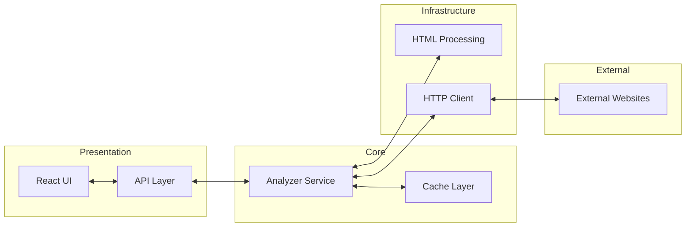

# Web Page Analyzer

A Golang-based web application that analyzes web pages and provides detailed information about their structure and content.

## System Architecture



## Project Overview

This application analyzes web pages by URL and provides the following information:
- HTML version detection
- Page title extraction
- Heading count by level (h1-h6)
- Classification of links (internal, external, and inaccessible)
- Login form detection

## Technology Stack

### Backend
- **Language**: Go 1.21+
- **Web Framework**: Gorilla Mux for routing
- **HTML Processing**: golang.org/x/net/html
- **API Documentation**: Swagger
- **Logging**: slog for structured logging
- **Testing**: Go's testing package with testify

### Frontend
- **Framework**: React 18
- **Styling**: Tailwind CSS
- **HTTP Client**: Axios
- **Form Validation**: Client-side validation with regex

### DevOps
- **Containerization**: Docker
- **Orchestration**: Docker Compose
- **Building**: Makefile for automated builds
- **Testing**: Automated tests with code coverage

## External Dependencies

### Backend
```
github.com/gorilla/mux v1.8.1
github.com/rs/cors v1.10.1
github.com/stretchr/testify v1.8.4
github.com/swaggo/http-swagger v1.3.4
github.com/swaggo/swag v1.16.2
golang.org/x/net v0.20.0
```

### Frontend
```
react: ^18.2.0
react-dom: ^18.2.0
axios: ^1.4.0
tailwindcss: ^3.3.2
```

## Installation and Setup

### Prerequisites
- Go 1.21 or later
- Node.js 18 or later
- npm 9 or later
- Docker and docker-compose (optional)

### Quick Start

#### Using Make (Recommended)
```bash
# Build both frontend and backend
make build

# Run the application
make run

# Run the tests
make test
```


#### Using Docker
```bash
# Build and run with docker-compose
docker-compose up --build
```

### Manual Setup

1. Build the frontend:
```bash
cd web
npm install
npm run build
cd ..
```

2. Build and run the backend:
```bash
go mod download
go build -o bin/web-analyzer ./cmd/server
./bin/web-analyzer
```

## Application Usage

### Web Interface
Access the web interface at [http://localhost:8080](http://localhost:8080)

1. Enter a URL in the input field
2. Click "Analyze"
3. View detailed analysis results

### API Endpoints

#### POST /api/analyze
Analyzes a web page by URL.

**Request:**
```json
{
  "url": "https://cnn.com"
}
```

**Response:**
```json
{
  "htmlVersion": "HTML5",
  "title": "Example Domain",
  "headings": {
    "h1": 1,
    "h2": 2,
    "h3": 0,
    "h4": 0,
    "h5": 0,
    "h6": 0
  },
  "links": {
    "internal": 5,
    "external": 3,
    "inaccessible": 1
  },
  "containsLoginForm": false
}
```

#### GET /api/health
Health check endpoint.

### API Documentation
Swagger UI is available at [http://localhost:8080/swagger/](http://localhost:8080/swagger/)

#### Generating Swagger Documentation
To regenerate the Swagger documentation after API changes:

```bash
# Install swag if not already installed
go install github.com/swaggo/swag/cmd/swag@latest

# Generate Swagger docs
./generate-swagger.sh
# Or manually:
swag init -g cmd/server/main.go -o ./docs
```

Once the server is running, access the Swagger UI at:
- [http://localhost:8080/swagger/index.html](http://localhost:8080/swagger/index.html)


### Running Tests
```bash
go test ./...

or

make test
```

### Development Mode
```bash
# Backend
make dev

# Frontend (in separate terminal)
make dev-frontend
```

## Challenges and Solutions

### Performance with Large Web Pages
- **Challenge**: Processing large web pages with many links caused timeouts
- **Solution**: Implemented concurrent link processing with goroutines and wait groups

### Link Classification
- **Challenge**: Determining if a link is internal or external with various URL formats
- **Solution**: Built robust URL parsing with proper handling of relative, fragment and absolute URLs

### HTML Version Detection
- **Challenge**: No standardized way to detect HTML version in Go libraries
- **Solution**: Created a custom detection algorithm using DOCTYPE parsing and HTML5 element detection

### Cross-Origin Requests
- **Challenge**: CORS issues when calling API from frontend
- **Solution**: Implemented proper CORS middleware with configurable allowed origins

## Future Improvements

1. Implement metrics collection with Prometheus
2. Add pprof integration for performance profiling
3. Enhance the caching layer with Redis
4. Add user authentication to save analysis history
5. Implement batch analysis for multiple URLs
6. Create export functionality (PDF, CSV)
7. Implement rate limiting to prevent abuse


## Code Coverage

Current test coverage: 70%+ for backend services

#### Generating Coverage Report
To generate the code coverage report:

```bash
# Run tests with coverage
go test -coverprofile=coverage.out ./...

# Generate HTML coverage report
go tool cover -html=coverage.out -o coverage.html

# View the report in your browser
open coverage.html
```

See `coverage.html` for detailed coverage report.

## Monitoring and Profiling

The Web Page Analyzer includes comprehensive monitoring and profiling tools:

### Prometheus Metrics

The application exposes Prometheus metrics at `/metrics`, tracking:

- Request counts by endpoint and status code
- Request duration by endpoint
- Analysis counts and duration
- Cache hits and misses

To view these metrics:
1. Access `http://localhost:8080/metrics` in your browser
2. Set up Prometheus to scrape this endpoint (see Prometheus setup below)

### pprof Profiling

For performance profiling and debugging, pprof endpoints are available at `/debug/pprof/`:

- Memory profiling: `http://localhost:8080/debug/pprof/heap`
- CPU profiling: `http://localhost:8080/debug/pprof/profile`
- Goroutine profiling: `http://localhost:8080/debug/pprof/goroutine`
- Block profiling: `http://localhost:8080/debug/pprof/block`

To use pprof for profiling:

```bash
# Install graphviz for visualization
sudo apt-get install graphviz

or for mac

 brew install graphviz

# Collect and view a 30-second CPU profile
go tool pprof -http=:8081 http://localhost:8080/debug/pprof/profile?seconds=30

# View memory allocations
go tool pprof -http=:8081 http://localhost:8080/debug/pprof/heap

# View goroutines
go tool pprof -http=:8081 http://localhost:8080/debug/pprof/goroutine